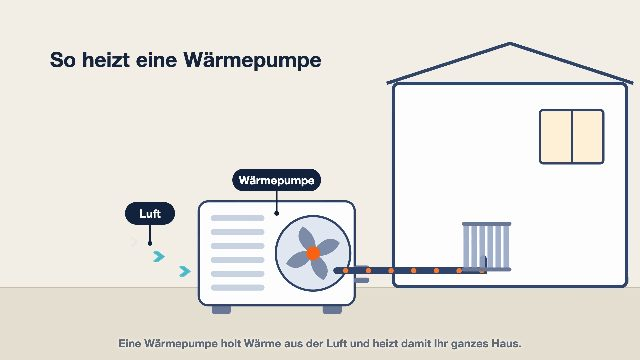

# Erklärfilm-Studio

Erklärvideos in sechs Stilen — gebaut von deinem KI-Agenten (Claude Code,
Codex o. ä.), gerendert über kie.ai und Remotion. Kein SaaS, keine App:
du lädst diese Repo, öffnest deinen Agenten darin und sagst ihm, was du
brauchst.

| Stil | Beispiel | Kosten/Film* |
|---|---|---|
| Hollywood |  | ~600–700 Credits (~3–3,50 $) |
| Aquarell |  | ~180 Credits (~0,90 $) |
| Cartoon |  | ~180 Credits (~0,90 $) |
| Hybrid |  | ~180 Credits (~0,90 $) |
| KI-Film (fotoreal) |  | ~200 Credits (~1 $) |
| Motion Design |  | ~60 Credits (~0,30 $, nur Bilder+Stimme) |

*Richtwerte für 35–90 s inkl. Stimme; 200 Credits = 1 USD (kie.ai).
Nachbesserungen (~10–30 % Reserve) einplanen.

## Schnellstart

```bash
# 1. Eigenen kie.ai-Schlüssel setzen (NIE in Dateien schreiben!)
export KIE_API_KEY=dein_schluessel

# 2. Abhängigkeiten
pip install opencv-python numpy pillow     # plus ffmpeg im System
cd mograph && npm install && cd ..         # nur für Motion Design

# 3. Agenten starten und einen Stil ansprechen
#    z. B. in Claude Code:  /hollywood  oder  /aquarell
#    "Bau mir ein Hollywood-Erklärvideo für <Firma>, hier der Link: ..."
```

Der Agent liest den jeweiligen Skill (`.claude/skills/<stil>/`) und
`PROZESS.md` und arbeitet die sieben Schritte ab — inklusive der zwei
Pflicht-Gates (Keyframe-Kontrolle vor den Video-Credits, Frame-Sweep vor
der Lieferung).

## Struktur

```
PROZESS.md            der 7-Schritte-Prozess (gilt für alle KI-Stile)
.claude/skills/       ein Skill pro Stil = das destillierte Wissen
scripts/              Maschinerie: Stimme, Keyframes, Clips, Schnitt, Ton, QA
mograph/              Remotion-Projekt für Motion Design (+ eigene ANLEITUNG)
beispiele/            fertige Drehbücher als Blaupausen (je Stil ein Fall)
galerie/              ein Referenzbild pro Stil
```

## Wichtig
- **Dein API-Schlüssel bleibt bei dir** — nur als Umgebungsvariable.
- Veröffentlichte fotorealistische KI-Videos brauchen in der EU seit
  08/2026 eine Kennzeichnung → `"kennzeichnung": true` im skript.json.
- Erst Konzept zeigen, dann generieren. Die teuerste Fehlerquelle ist ein
  Video ohne Idee.
